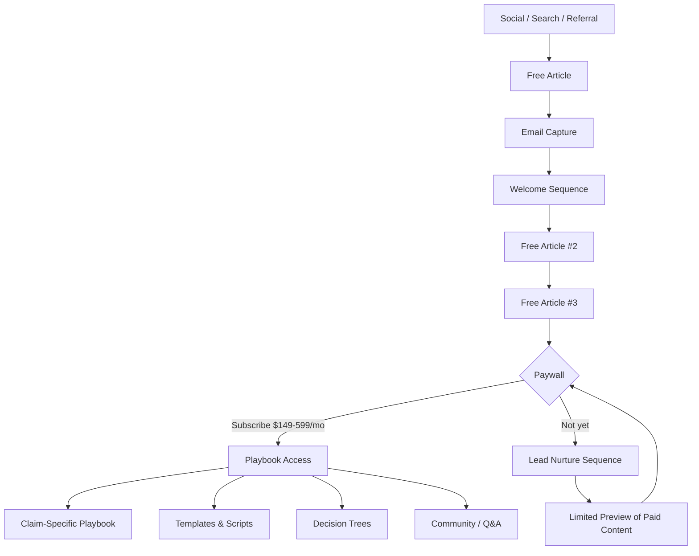

# Content Pipeline

## The Funnel

## Content Tiers

### Free Tier (Top of Funnel)
**Goal:** Prove you know what you're talking about. Give enough value to be shared. Create the "I need more" moment.

| Content Type | Example | Why It Works |
|---|---|---|
| Insider confessions | "What Your Adjuster Knows That You Don't" | Establishes unique credibility immediately |
| Horror stories with lessons | "The $47,000 Mistake: How One Policyholder Lost Their Roof Claim" | Emotional hook + practical takeaway |
| Process explainers | "How Adjusters Actually Calculate Your Payout" | Demystifies the black box |
| "They hope you don't know" | "The 3 Clauses Adjusters Use to Deny Claims" | Creates urgency + positions you as protector |
| Timeline guides | "The First 72 Hours After a Fire" | Actionable, shareable, time-sensitive |

### Paid Tier (Behind Paywall)
**Goal:** The actual playbook. Specific enough to justify $149-599/mo. The subscriber feels like they have an adjuster on retainer.

| Content Type | Example | Price Tier |
|---|---|---|
| Claim-specific playbooks | "The Complete Roof Claim Playbook" | $149 |
| Templates and scripts | "Adjuster Negotiation Scripts: Exact Language" | $199 |
| Decision trees | "When to Lawyer Up: A Decision Framework" | $249 |
| Video walkthroughs | "How to Document Water Damage: Room by Room" | $299 |
| Live Q&A / case review | "Submit Your Claim Scenario" | $599 |
| Emergency response kits | "Fire Claim Emergency Kit: First 48 Hours" | $199 |

## Content Production Pipeline

### Stage 1: Research
- Source adjuster training materials, internal guidelines
- Case law and claim precedents
- Insurance regulations by state
- Real claim examples (anonymized)
- Competitor content (what's missing, what's wrong)

### Stage 2: Outline
- One core insight per article
- 3-5 supporting points
- At least one specific, named example or statistic
- Visual elements identified (diagram, flowchart, comparison)

### Stage 3: Draft
- Written in the house voice: authoritative, insider, specific, slightly combative
- No fluff. No "in today's world." No hedging.
- Every paragraph earns its place or gets cut

### Stage 4: Humanize
- Full 37-pattern anti-AI pass
- Burstiness injection (vary sentence rhythm)
- Opinion injection (take a position)
- Read-aloud polish pass

### Stage 5: Illustrate
- Decision trees for complex processes (Mermaid in Obsidian)
- Comparison tables for coverage types
- Process diagrams for claim timelines
- Infographics for data-heavy sections

### Stage 6: Publish
- Substack post (free articles)
- Email to subscriber list
- Social teasers (X, LinkedIn, relevant forums)
- Cross-link to related content

## Email Capture Strategy

Every free article ends with a specific lead magnet — not "subscribe for more" but a concrete next step:

- "Download the Damage Documentation Checklist (free)"
- "Get the Adjuster Communication Script (free)"
- "Access the Claim Timeline Calculator (free)"

These capture emails and feed the welcome sequence.

## Welcome Sequence (5 emails, 10 days)

1. **Day 0:** "You're in. Here's what you get." — Deliver the lead magnet, set expectations
2. **Day 2:** "The one thing most policyholders get wrong" — Value-first, establish authority
3. **Day 5:** "How I used to evaluate claims (and how to use that against me)" — Insider insight
4. **Day 8:** "The Roof Claim Playbook preview" — Tease paid content with a free section
5. **Day 10:** "Ready to never lose a claim again?" — Hard pitch to paid subscription

## Monetization Architecture

| Tier | Price | Includes |
|---|---|---|
| **Free** | $0 | Public articles, one lead magnet, welcome emails |
| **Standard** | $149/mo | All playbooks, templates, email support |
| **Premium** | $299/mo | + Live monthly Q&A, priority email response |
| **Elite** | $599/mo | + Claim review, custom strategy, phone consult |

---

→ [[Free vs Paid Strategy]] for the detailed breakdown of what goes where

→ [[Editorial Calendar]] for the publishing schedule

→ [[Publication Hub]] for the overview
