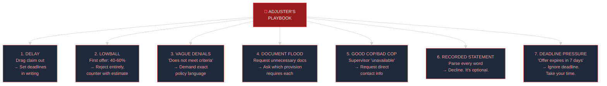
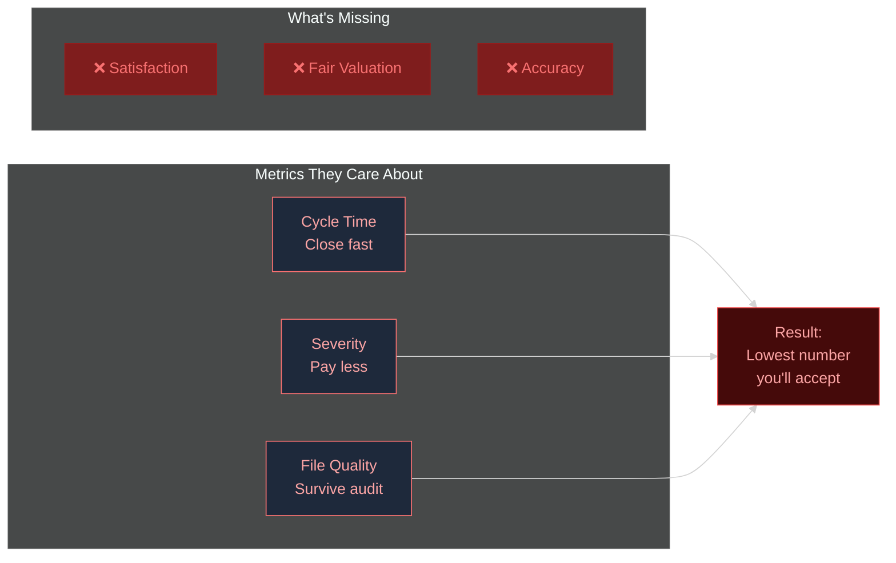

# The Adjuster's Playbook — Visual Reference

> Companion to [[Articles/01 - What Your Adjuster Knows]]
> [Open full interactive version in browser →](adjuster-playbook.html)

---

## The 7 Tactics & Counter-Moves

---

## The Claims Funnel — How Adjusters Are Evaluated

---

## Key Stats

| Metric | Value |
|---|---|
| Claims handled (12 years) | 8,000+ |
| First offer as % of value | 40-60% |
| Policyholders who accept first offer | Most |
| Cost to access full playbooks | $149/mo |
| Average claim value recovery | $10K-50K+ |

[Open full interactive dashboard →](adjuster-playbook.html)