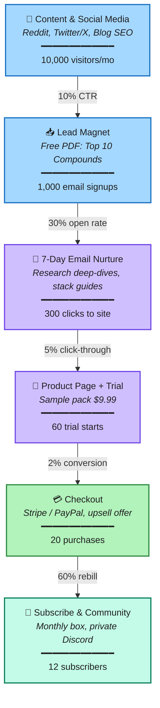

# Cognitive Supplement Marketing Funnel

> E-commerce conversion flow — mock projection for a cognitive supplement brand.

---

## Traffic Sources

| Channel | Tactic | Est. Traffic |
|---------|--------|-------------|
| Reddit | r/Nootropics, r/Nootopics — research breakdowns, Q&A, AMAs | ~40% |
| Twitter/X | Long-form threads, compound spotlights, thread hooks | ~25% |
| Blog / SEO | Evergreen articles: "Best nootropics 2026", compound deep-dives | ~25% |
| Paid Retargeting | Meta + Google Ads, pixel-based, lookalike audiences | ~10% |

---

## Stage Breakdown

### TOFU — Top of Funnel

**1. Content & Social Media**
- Educational threads and research breakdowns
- Build authority before asking for anything
- Key metric: 10,000 visitors/month
- → [[Content Strategy]] | [[SEO Plan]]

**2. Lead Magnet — Free PDF Guide**
- "Top 10 Cognitive Compounds in 2026"
- Email gate, instant download — low friction
- CTA: inline in blog posts, pinned tweet, Reddit profile link
- → [[Lead Magnet Ideas]] | [[Email Capture]]

---

### MOFU — Middle of Funnel

**3. 7-Day Email Nurture Sequence**
- Day 1: Welcome + quick win (one simple compound to try)
- Day 3: Deep-dive research on a popular nootropic
- Day 5: Stack guide — how compounds work together
- Day 7: Social proof + soft pitch to product page
- → [[Email Sequences]] | [[Copywriting]]

**4. Product Page + Trial Offer**
- Sample pack at $9.99 — removes price objection
- 30-day money-back guarantee — removes risk
- Lab reports, testimonials, ingredient transparency
- → [[Product Pages]] | [[Conversion Optimization]]

---

### BOFU — Bottom of Funnel

**5. Checkout**
- Stripe / PayPal — standard, trusted processors
- One-click upsell: "Add monthly subscription, save 20%"
- Abandoned cart recovery email at 2h and 24h
- → [[Checkout Flow]] | [[Cart Abandonment]]

**6. Subscription & Community**
- Monthly supplement box — curated, rotating compounds
- Private Discord — early access, compound discussions
- Referral program: "Give 20%, get 20%"
- → [[Community Building]] | [[Retention]]

---

## Conversion Waterfall

| Stage          | Count  | Conversion | Visual               |
| -------------- | ------ | ---------- | -------------------- |
| Visitors       | 10,000 | —          | ████████████████████ |
| Email Signups  | 1,000  | 10.0%      | ██████████           |
| Nurture Clicks | 300    | 30.0%      | ███                  |
| Trial Starts   | 60     | 20.0%      | █                    |
| Purchases      | 20     | 33.3%      | ▌                    |
| Subscribers    | 12     | 60.0%      | ▎                    |

---

## Revenue Math

| Metric | Value |
|--------|-------|
| Average Order Value (AOV) | $49 |
| Monthly Revenue (20 orders) | $980 |
| Subscribers (12 × $49/mo) | $588/mo recurring |
| Annual Run Rate | **$18,816** |
| LTV per Subscriber | $588/yr |
| CAC Target (breakeven at 12 mo) | < $49 |

---

## Key Assumptions

- Organic traffic driven by content, not paid ads (low CAC)
- Nootropics audience is research-heavy — trust and authority matter more than discounts
- Sample pack → subscription is the core business model
- Email nurture builds the relationship before asking for money
- Community keeps subscribers from churning

---

*Created: May 2026 | Status: Mock / Planning*
