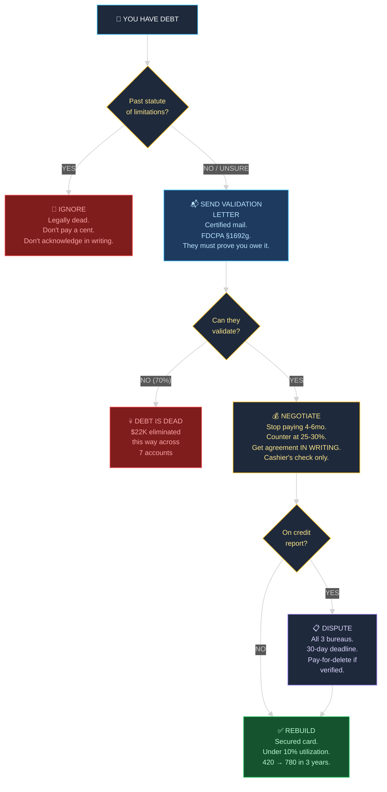

# The Debt Elimination Decision Tree — Visual Reference

> Companion to [[Articles/01 - They're Counting On You]]
> [Open full interactive version in browser →](debt-decision-tree.html)

---

## The Decision Framework

---

## Key Stats

| Metric | Value |
|---|---|
| Total debt eliminated | $87,000 |
| Validation letter success rate | ~70% |
| Debt eliminated via validation | $22,000 |
| Best settlement | $14K → $4,200 (30%) |
| Credit score | 420 → 780 |
| Time to rebuild | ~3 years |
| Cost to access full library | $99/mo |

---

## The Weapons In Order

| Priority | Weapon | When | Cost |
|---|---|---|---|
| 1st | Statute of limitations | Debt is 3-6+ years old | $0 |
| 2nd | Debt validation letter | Within 30 days of contact | ~$5 |
| 3rd | Settlement negotiation | Debt is valid & collectible | 25-40% of balance |
| 4th | Credit report dispute | Negative items on report | ~$5/letter |
| 5th | Pay-for-delete | Verified debt, want clean report | Negotiated |

[Open full interactive decision tree →](debt-decision-tree.html)