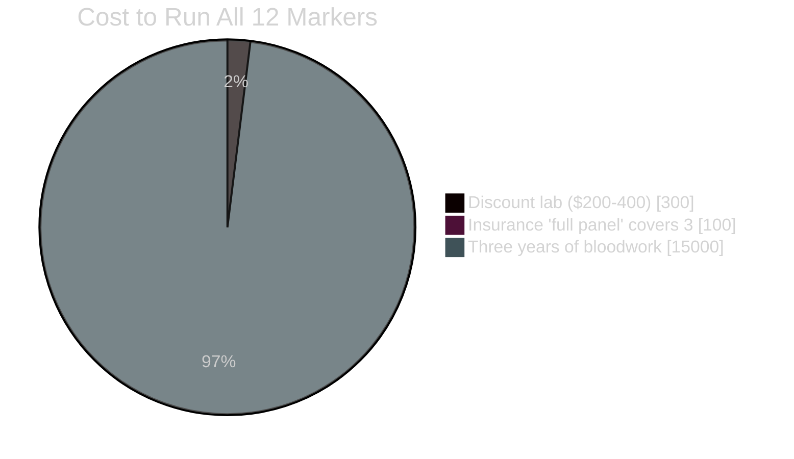

# The 12 Markers Dashboard

> Companion to [[Articles/01 - The 12 Markers Your Doctor Won't Order]]

Open in browser for full interactive version: [12-markers-dashboard.html](12-markers-dashboard.html)

---

## Standard vs Optimal Ranges

```mermaid
%%{init: {'theme':'dark', 'themeVariables': {'fontSize':'14px'}}}%%
xychart-beta
    title "HS-CRP (mg/L)"
    x-axis "Standard" "Optimal" "My First" "My Current"
    bar [3.0, 0.5, 3.2, 0.4]
```

---

## All 12 Markers — Before vs After

| # | Marker | Standard Range | Optimal Range | Before | After |
|---|---|---|---|---|---|
| 1 | HS-CRP | <3.0 mg/L | <0.5 | 3.2 | 0.4 ✅ |
| 2 | Homocysteine | <15 µmol/L | <7 | 12.1 | 6.8 ✅ |
| 3 | Free Testosterone | >15 ng/dL | >15 | 8.2 | 16.1 ✅ |
| 4 | Vitamin D (25-OH) | 30-100 | 50-80 | 28 | 68 ✅ |
| 5 | HbA1c | <5.7% | <5.3% | 5.5 | 5.0 ✅ |
| 6 | Fasting Insulin | <25 µIU/mL | <5 | 12.0 | 3.2 ✅ |
| 7 | TSH | 0.5-4.5 | 0.5-2.0 | — | — |
| 8 | Ferritin | 15-150 | 70-100 | 38 | 82 ✅ |
| 9 | Magnesium RBC | 4.0-6.4 | >6.0 | 4.2 | 5.8 → |
| 10 | Omega-3 Index | >4% | >8% | 4.2 | 10.1 ✅ |
| 11 | ApoB | <90 | <60 | 84 | 52 ✅ |
| 12 | Zinc | 60-120 | 90-120 | 68 | 98 ✅ |

✅ = achieved optimal range   → = approaching

---

## Cost Comparison



---

### Key Insight

> Normal standard labs + terrible optimal labs = someone who "feels fine" but is slowly deteriorating.

[Open full dashboard in browser →](12-markers-dashboard.html)